# 诊所在线预约系统i北理前端

本项目为诊所在线预约系统学校i北理平台上的前端。

## 特性

- 使用 Vue.js + VUX 提供最佳体验
- 提供公告、日历、当前工单、历史工单等等功能
- 接入i北理

## 访问方式

i北理 -> 我的北理 -> IT服务 -> 电脑义诊

## 项目架构图

## 项目结构

- `records/` i北理前端
- `misc/` 其他内容

## 使用方式

与 https://github.com/BITNP/clinic_proxy_dingtalk 一同部署。

运行前端服务，请参考相应[README](./records/README.md)

## FAQ

### 如何创建本地开发环境

通常我会在本地同时启动 django, grails, 前端部分。

## Contributes

欢迎提交 Issues 和 PR
